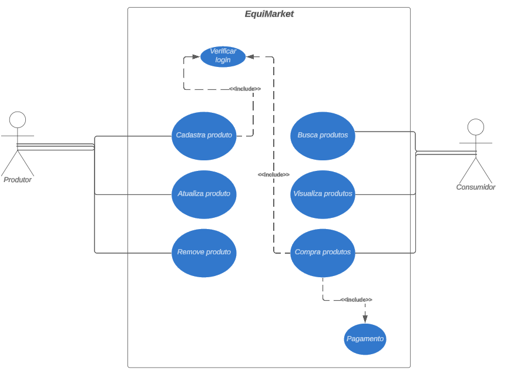

# 📝 Diagrama de Caso de Uso

## 🎭 Sobre os Atores

Temos dois atores principais no nosso sistema:

- **Produtor:** É a pessoa ou entidade que produz os produtos que serão vendidos na plataforma. Eles têm a capacidade de:
  - Adicionar produtos
  - Atualizar produtos
  - Remover produtos

- **Consumidor:** É a pessoa ou entidade que tem como objetivo comprar produtos na plataforma. Eles têm a capacidade de:
  - Pesquisar produtos
  - Visualizar produtos
  - Fazer uma compra